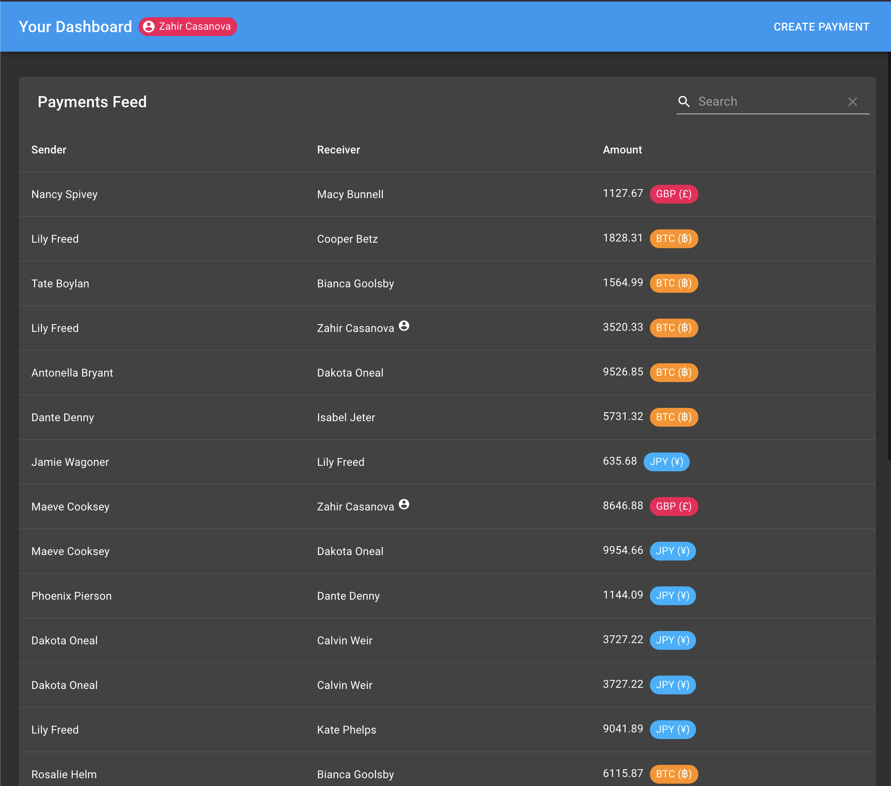
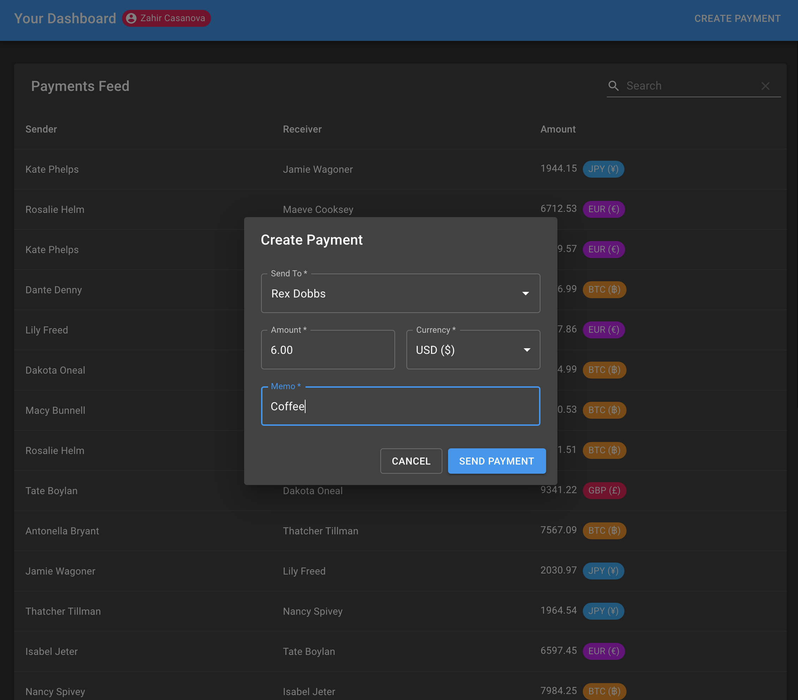

##Payments Data Dashboard

####[Project Instructions/Guidelines](Assignment.md)

## Instructions for Running App Locally 
### Install Packages
(I am using node 12)

1) From the root directory, run:
##### `cd server/` then `yarn intall`

2) From the root directory, run:
##### `cd client/` then `yarn install`

### Run App
1) To start the backend, from the root directory, run:
##### `cd server/` then `yarn start`

2) To start the frontend, from the root directory, run: 
##### `cd client/` then `yarn start`

## Improvements To Be Made With More Time
* Add testing.
* Improve error handling.
* Add responsive/adaptive design.
* Add filter for user to easily see payments involving him/herself.
* For created payments:
    * add correct formatting of each currency/amount (ex: $4 should be saved as $4.00)
    * make sure people cannot submit invalid amounts (ex: $5.0043 should not be allowed, but 5.0043 BTC should)
